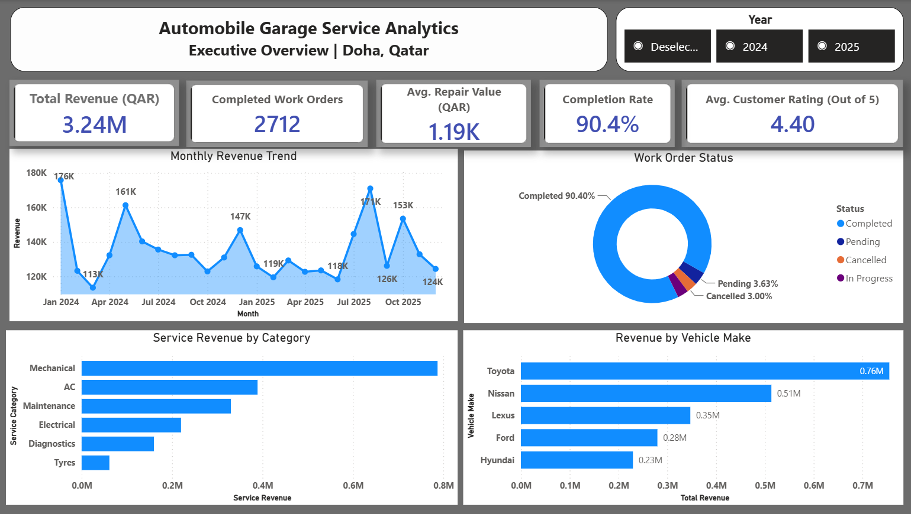
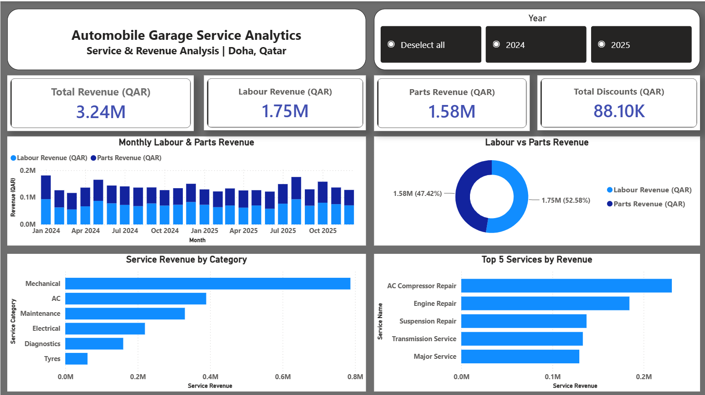
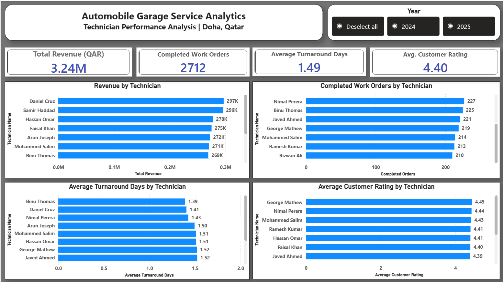
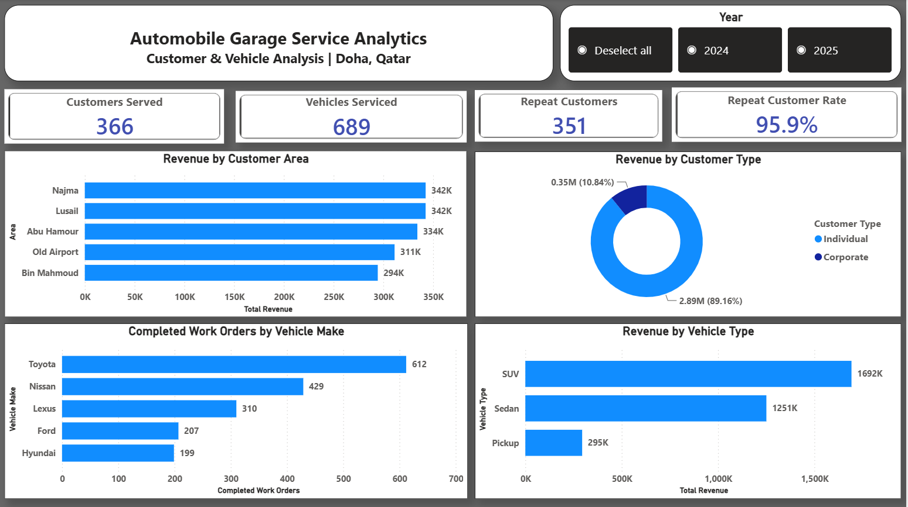

# Doha Automobile Garage Service Analytics

## Power BI Business Intelligence Project

A multi-page Power BI analytics solution designed to analyze the operational and financial performance of a fictional automobile service garage in Doha, Qatar.

This project demonstrates an end-to-end Business Intelligence workflow using a **synthetic automotive service dataset**, including data preparation, relational data modeling, DAX calculations, KPI development, and interactive dashboard design.

> **Disclaimer:** This is a business simulation project created for portfolio and learning purposes. The dataset is synthetic and does not represent an actual automobile garage, customer, or organization.

---

## Project Overview

Automobile service businesses generate data across customers, vehicles, work orders, services, parts, technicians, payments, and customer feedback.

The objective of this project was to transform this operational data into an interactive Power BI solution that enables management to monitor business performance and answer questions related to:

- Revenue performance
- Work order completion
- Labour and parts revenue
- Service category performance
- Customer behavior
- Vehicle service patterns
- Technician productivity
- Turnaround time
- Customer satisfaction

The dataset covers the period from **January 2024 to December 2025**.

---

## Business Objectives

The dashboard was developed to answer key management questions such as:

1. How much revenue is generated by completed work orders?
2. How is revenue changing over time?
3. What proportion of work orders are successfully completed?
4. Which service categories generate the most service revenue?
5. How are labour and parts contributing to billed revenue?
6. Which vehicle makes generate the highest service volume?
7. Which customer areas and customer types contribute the most revenue?
8. How many customers return for multiple completed services?
9. How do technicians compare in revenue, completed work orders, turnaround time, and customer ratings?
10. Which vehicle types contribute the most revenue?

---

## Dataset

The project uses a synthetic relational dataset representing the operations of a medium-sized independent automobile garage in Doha.

The model contains the following tables:

| Table | Description |
|---|---|
| Customers | Customer profiles, types, nationality, area, and registration information |
| Vehicles | Vehicle ownership, make, model, year, type, fuel type, and mileage |
| Technicians | Technician information, specialization, experience, and joining date |
| Services | Service catalogue, categories, standard prices, and estimated hours |
| Parts | Automotive parts, categories, costs, selling prices, and suppliers |
| WorkOrders | Garage work orders, dates, status, financial values, payment method, and customer ratings |
| WorkOrderServices | Services associated with individual work orders |
| WorkOrderParts | Parts associated with individual work orders |
| DateTable | Calendar table used for time-based analysis |

The main transactional dataset contains **3,000 work orders** across the two-year analysis period.

---

## Data Model

The Power BI model uses a relational structure connecting customers, vehicles, work orders, technicians, services, parts, and the Date table.

Main relationships:

```text
Customers
    │
    └── Vehicles
            │
            └── WorkOrders
                    ├── Technicians
                    ├── WorkOrderServices ── Services
                    └── WorkOrderParts ───── Parts

DateTable ── WorkOrders[OpenDate]
```

The Date table is connected to `WorkOrders[OpenDate]` and provides the time dimension used by the Year slicer and monthly trend analysis.

---

## Data Preparation

Data preparation and validation were performed using **Power Query** before building the analytical model.

Key preparation activities included:

- Importing the required Excel tables
- Reviewing column names and data types
- Validating primary identifier columns
- Checking work order and transaction records
- Reviewing missing values
- Validating date fields
- Reviewing work order status values
- Checking monetary fields
- Confirming relationships between customers, vehicles, work orders, services, parts, and technicians
- Creating and integrating a dedicated Date table for time analysis

Null values in fields such as close date, payment method, and customer rating were retained where they logically corresponded to pending, in-progress, or cancelled work orders.

---

## Key DAX Measures

The analytical layer was developed using DAX measures.

Examples include:

```DAX
Total Revenue =
CALCULATE(
    SUM(WorkOrdersTable[TotalAmount]),
    WorkOrdersTable[WorkOrderStatus] = "Completed"
)
```

```DAX
Completed Work Orders =
CALCULATE(
    DISTINCTCOUNT(WorkOrdersTable[WorkOrderID]),
    WorkOrdersTable[WorkOrderStatus] = "Completed"
)
```

```DAX
Average Repair Value =
DIVIDE(
    [Total Revenue],
    [Completed Work Orders],
    0
)
```

```DAX
Completion Rate =
DIVIDE(
    [Completed Work Orders],
    [Total Work Orders],
    0
)
```

```DAX
Average Turnaround Days =
AVERAGEX(
    FILTER(
        WorkOrdersTable,
        WorkOrdersTable[WorkOrderStatus] = "Completed"
            && NOT ISBLANK(WorkOrdersTable[CloseDate])
    ),
    DATEDIFF(
        WorkOrdersTable[OpenDate],
        WorkOrdersTable[CloseDate],
        DAY
    )
)
```

Additional measures were created for:

- Labour Revenue
- Parts Revenue
- Total Discounts
- Service Revenue
- Average Customer Rating
- Customers Served
- Vehicles Serviced
- Repeat Customers
- Repeat Customer Rate

---

# Dashboard

The Power BI report contains four analytical pages.

## 1. Executive Overview

Provides management with a high-level view of overall garage performance.

Key metrics include:

- **Total Revenue:** QAR 3.24M
- **Completed Work Orders:** 2,712
- **Average Repair Value:** QAR 1.19K
- **Completion Rate:** 90.4%
- **Average Customer Rating:** 4.40 / 5

The page also analyzes monthly revenue trends, work order status, service category performance, and revenue by vehicle make.



---

## 2. Service & Revenue Analysis

Provides deeper analysis of the garage's revenue composition and service performance.

Key metrics include:

- **Total Revenue:** QAR 3.24M
- **Labour Revenue:** QAR 1.75M
- **Parts Revenue:** QAR 1.58M
- **Total Discounts:** QAR 88.10K

The page analyzes:

- Monthly labour and parts revenue
- Labour versus parts revenue contribution
- Service revenue by category
- Top 5 services by service revenue



> **Note:** Service Revenue is calculated from service-line transactions and is used for service/category analysis. It is analytically distinct from billed Total Revenue, which is calculated from work-order financial amounts.

---

## 3. Technician Performance Analysis

Evaluates technician performance across multiple operational dimensions.

The analysis includes:

- Revenue contribution
- Completed work orders
- Average turnaround time
- Average customer rating

This provides a balanced view of technician performance rather than defining performance using a single metric.



---

## 4. Customer & Vehicle Analysis

Analyzes customer engagement and vehicle service patterns.

Key metrics include:

- **Customers Served:** 366
- **Vehicles Serviced:** 689
- **Repeat Customers:** 351
- **Repeat Customer Rate:** 95.9%

The page also analyzes:

- Top customer areas by revenue
- Revenue by customer type
- Completed work orders by vehicle make
- Revenue by vehicle type



---

## Key Insights

Several business insights can be observed from the dashboard:

- Completed work orders generated approximately **QAR 3.24M** in total revenue.
- The garage achieved a **90.4% work order completion rate**.
- Average revenue per completed repair was approximately **QAR 1.19K**.
- Labour contributed approximately **QAR 1.75M**, while parts contributed approximately **QAR 1.58M** before discounts.
- Mechanical services generated the highest service-line revenue among the analyzed service categories.
- Toyota recorded the highest completed service volume among vehicle makes.
- Individual customers contributed approximately **89% of total completed-work-order revenue**.
- SUVs generated the highest revenue among vehicle types.
- **351 of 366 served customers** had more than one completed work order during the full two-year analysis period.
- Technician performance varies depending on the metric used, demonstrating the importance of evaluating revenue, workload, turnaround time, and customer satisfaction together.

---

## Tools & Technologies

- **Microsoft Power BI Desktop** — dashboard development and visualization
- **Power Query** — data preparation and transformation
- **DAX** — measures and business calculations
- **Microsoft Excel** — source dataset
- **Git & GitHub** — project documentation and version control

---

## Repository Structure

```text
Doha_Auto_Garage_Analytics/
│
├── Dashboard/
│   └── Doha_Auto_Garage_Analytics.pbix
│
├── Data/
│   └── Doha_Auto_Garage_Analytics.xlsx
│
├── Documentation/
│
├── Images/
│   ├── 01_Executive_Overview.png
│   ├── 02_Service_Revenue_Analysis.png
│   ├── 03_Technician_Performance_Analysis.png
│   └── 04_Customer_Vehicle_Analysis.png
│
└── README.md
```

---

## Skills Demonstrated

This project demonstrates practical experience in:

- Business Intelligence
- Power BI dashboard development
- Data cleaning and transformation
- Relational data modeling
- DAX measure development
- KPI design
- Time-based analysis
- Customer analytics
- Revenue analysis
- Operational performance analysis
- Data visualization
- Business insight generation

---

## Project Disclaimer

This project is a **business simulation using synthetic data** created specifically for portfolio and educational purposes.

The business, customers, vehicles, technicians, work orders, financial transactions, and other records represented in the dataset are fictional and should not be interpreted as information belonging to a real automobile garage or organization.

---

## Author

© 2026 Sarveshwaran Balakrishnan

**Software Professional | Software Quality Engineering → Data Analytics & BI**